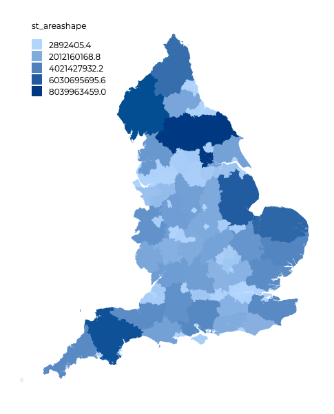

# choromap

A [Google Data Studio](https://datastudio.google.com/u/0/) community visualisation tool to create bespoke choropleth maps using [D3.js](https://d3js.org/) created by [Michael Hodge](github.com/mshodge). Here is a [Data Studio example of choromap](https://datastudio.google.com/reporting/4617cbac-3514-4c8d-a999-a3cb6683e579).



## Background

[Google Data Studio](https://datastudio.google.com/u/0/) is a powerful tool to create dashboards and visualisations. The user can upload local data, or use data contained within another Google product (such as Google Sheets or Google BigQuery). Currently, Data Studio only has two cartographic tools: Geo Map and Google Maps.

Geo Map allows for the creation of choropleth maps at country and sub-country level. For the US, this is US and state level. For the UK, this is UK and devolved nation level. Choropleths cannot be created for smaller areas than these. Google Maps within Data Studio allows for the plotting of Bubble Maps, whose centroid can be tied to areas as large as a country, or specific latitude and longitudes. Currently, there is no ability to visualise polygons in Google Maps in Data Studio, meaning choropleths cannot be created.

We have here created a community visualisation to generate choropleth maps based on the desired boundaries data.

## Data

Google Data Studio does not load in BigQuery GEOGRAPHY data. Therefore all geographical data must be loaded in as a string. A sample data set for England's Counties and Unitary Authorities can be found [here (6.97 MB)](https://storage.cloud.google.com/choromap/choromap.csv?organizationId=425126312691&supportedpurview=project). The schema of this data is as follows:

| Column Name | Description | type |
| -----------   | ----------- | --- |
| Row | The row number | STRING |
| ctyua20cd | The area code | STRING |
| ctyua20nm | The area name | STRING |
| geometry | The geometry | STRING |
| st_areashape | The shape area | float |
| st_lengthshape | The shape length | float |

The important column is `geometry`. Below is a sample of the geometry for `The City of London` in the UK:

```txt
{"type":"MultiPolygon","coordinates":[[[[-0.096786300655468,51.52332130413849],[-0.096469831048681,51.52282154015623],[-0.095088768971737,51.52313723284216],[-0.094344739975396,51.5214831278268],[-0.092516830405343,51.52148578000455],[-0.092374579177695,51.52102758467574],[-0.08969358569076,51.52071506110647],[-0.090004405037251,51.51997008801451],[-0.086227541891935,51.51880878001998],[-0.085217909720332,51.52033453455192],[-0.083325592193781,51.51981439149066],[-0.081762362787683,51.52075732827536],[-0.081050452990135,51.52195339914494],[-0.078471489442032,51.52151013413389],[-0.079429829306423,51.51884510407231],[-0.078082679099946,51.51896786642452],[-0.078146943602546,51.51846889558505],[-0.076876952796642,51.51665852905],[-0.073969190592163,51.51445357376097],[-0.073063262728713,51.5118083055404],[-0.072781089875862,51.51029829096138],[-0.074550758806615,51.50995867750763],[-0.075584143211524,51.5097499891425],[-0.076285605682929,51.5105438078804],[-0.077789551314662,51.51011438065631],[-0.078882667624717,51.50941192157917],[-0.079099326627114,51.50905757810306],[-0.078721305098214,51.50882744549881],[-0.079395354287654,51.50781128259451],[-0.080360355480934,51.50808169862811],[-0.085479453429595,51.50860342872304],[-0.087115487530159,51.50898448206557],[-0.088668830381722,51.50896992503621],[-0.091976761860799,51.50942135075249],[-0.095234497930682,51.51017176588185],[-0.095201094749157,51.51061514125803],[-0.096162542706015,51.51026430527382],[-0.099899320495398,51.51082545323712],[-0.108470620393255,51.51087126554509],[-0.11158056489403,51.51083164484565],[-0.111567244164817,51.51173049399255],[-0.112414895757562,51.51276926532587],[-0.111738730695415,51.51319547361804],[-0.111980747153716,51.51368491737404],[-0.111101534210641,51.51382547859707],[-0.111606871170285,51.51533799647236],[-0.113821109173385,51.51825760445579],[-0.107826700590834,51.51776531637376],[-0.105349963286698,51.51854099504494],[-0.101820882919502,51.5196655764016],[-0.100301084969584,51.52012831764441],[-0.097670260922139,51.5207223492556],[-0.097624204154032,51.52103184600052],[-0.097403288303114,51.5215930126154],[-0.097972548740085,51.52287738232243],[-0.096786300655468,51.52332130413849]]],[[[-0.10423511672847,51.5086262019039],[-0.104688136951949,51.50840920893765],[-0.104701932690223,51.50863143466984],[-0.10423511672847,51.5086262019039]]]]}
```

As seen this is a GeoJSON file disguised as a STRING object (pseudo-GeoJSON). This is important. 

### Create your own data set

To create the raw CSV file from a shapefile, please refer to [Lak Lakshmanan's Medium post on 'How to load geographic data like shapefiles into BigQuery'](https://medium.com/google-cloud/how-to-load-geographic-data-like-zipcode-boundaries-into-bigquery-25e4be4391c8). This data can then be joined with other data sets that contain a matching ID. In the example we just use the variables within the original shapefile (the area and length of the polygons). Below is a simplified version of Lak's post (requires `gdal-bin`):

1. Download a shapefile (.shp) of the geometries you wish to plot. For example [Counties (December 2017) Super Generalised Clipped Boundaries in England by ONS](http://geoportal.statistics.gov.uk/datasets/counties-december-2017-super-generalised-clipped-boundaries-in-england)
2. Unzip the folder.
3. `cd` to the folder.
4. Run `ogr2ogr -f csv -dialect sqlite -sql "select AsGeoJSON(geometry) AS geom, * from <filename>" <filename>.csv <filename>.shp` where `<filename>` is the filename of the shapefile.
5. Upload the generated CSV file to Google Cloud Storage, BigQuery, Google Sheets, or keep locally (Data Studio handles lots of different ways of ingesting data)

### Known Limitations

* Because of something called a [winding convention order](https://github.com/d3/d3-geo#d3-geo) raw GeoJSON files will not work. The file must be a pseudo-GeoJSON CSV file created using the method above.
* Unfortunately, BigQuery public data sets also use the same convention as GeoJSON and therefore cannot be converted easily to use with this tool.
* Both the above limitations can be resolved largely by *simplifying* the geometries using `ST_SIMPLIFY` but this ultimately makes the geometries more *simple*. For plotting this isn't too much of an issue, but complex geometries are important for computational geometry.

## D3 code

We created our code using a mash of approaches largely from [Most basic choropleth map in d3.js
](https://www.d3-graph-gallery.com/graph/choropleth_basic.html), [Choropleth map with hover effect in d3.js
](https://www.d3-graph-gallery.com/graph/choropleth_hover_effect.html), [Observable's Choropleth Guide](https://observablehq.com/@d3/choropleth) as well as countless StackOverflow answers.

We also largely followed the [Create Custom Javascript Visualizations in Data Studio Codelab guide](https://codelabs.developers.google.com/codelabs/community-visualization/#0).

The `src` folder comprises the four important files for Data Studio:

- choromap.css (any css to make things look nice)
- choromap.js (the bulk of the code)
- choromap.json (all the parts needed for customisation in Data Studio)
- manifest.json (all information for the community visualisation tool)

`choromap.js` uses a lot of pre-existing D3 libraries, such as the tool-tip and legend libraries. Our code starts all the way down in line `17539`. In a nutshell it gets all the config information from the user, creates the SVG, creates a GeoJSON looking-type object from the information it gets (including the STRING geometry field), and then draws the map.

## Using choromap in Data Studio

To use choromap first import it into your Data Studio report:

- Click custom visualisations and components
- Click Explore More
- Click Build your own visualisation
- In the manifest path type `gs://choromap/`

Then add the chart to your report. In the `DATA` tab, for the `Dimensions` make sure the first is the name of code of the area and the second the STRING geometry column. You can then select a `Metric` you want the colormap to plot against. In the sample data this may be st_areashape or st_lengthshape. In the `STYLE` tab you can then customise:

- the minimum value plot colour
- the maximum value plot colour
- the null value plot colour
- the boundary line colour
- the boundary line width
- the text colour
- show or remove the legend
- add a title for the legend

## Filtering

Many thanks to GitHub user [sesi](https://github.com/sesi) for working this one out. You can now filter data using choromap. First click 'apply filter' at the bottom of the DATA tab, then click an area in choromap to filter data for other charts on the same page.

## Contributing and Bugs

See [CONTRIBUTING.md](CONTRIBUTING.md) for guidelines on how to contribute. For all Bugs please raise an Issue ticket.
