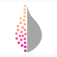

# violin

A [Google Data Studio](https://datastudio.google.com/u/0/) community visualisation tool to create bespoke violin plots using [D3.js](https://d3js.org/) created by [Michael Hodge](github.com/mshodge). Here is a [Data Studio example of violin](add link).

## Background

[Google Data Studio](https://datastudio.google.com/u/0/) is a powerful tool to create dashboards and visualisations. The user can upload local data, or use data contained within another Google product (such as Google Sheets or Google BigQuery). Currently, Data Studio does not have statistical tools such as histogram plotting.

We have here created a community visualisation to generate violin plots based on input data.

## Data

violin uses two Dimensions. The first is the numeric data you want to plot. The second is the categories you wish to split the data by.

## Contributing and Bugs

See CONTRIBUTING.md for guidelines on how to contribute. For all Bugs please raise an Issue ticket.